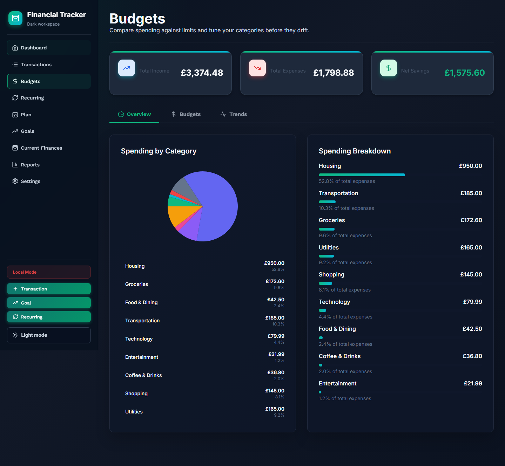
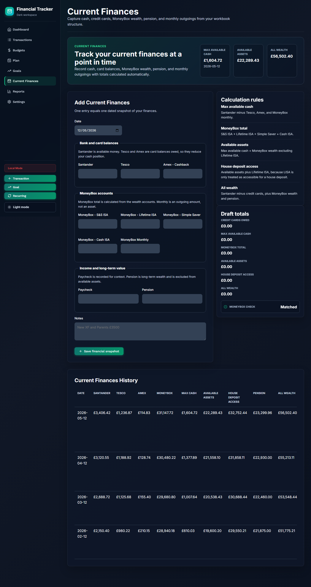
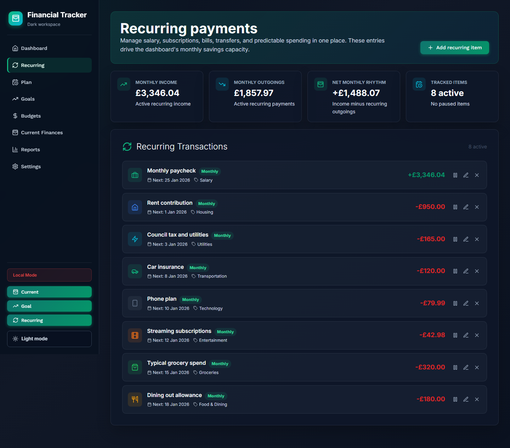
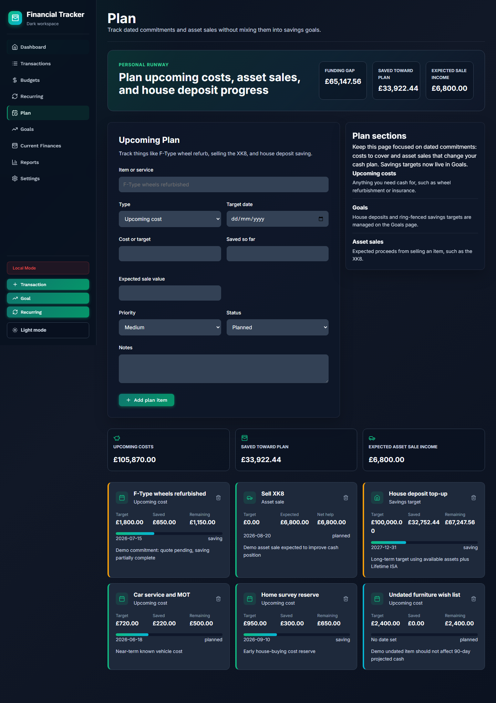
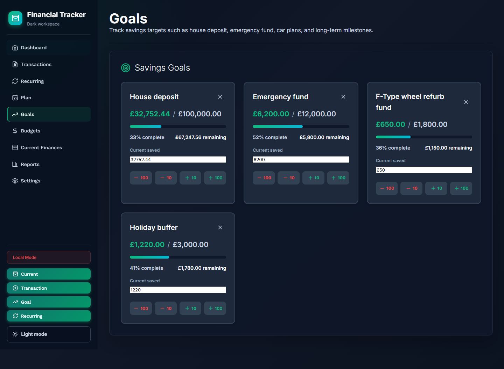
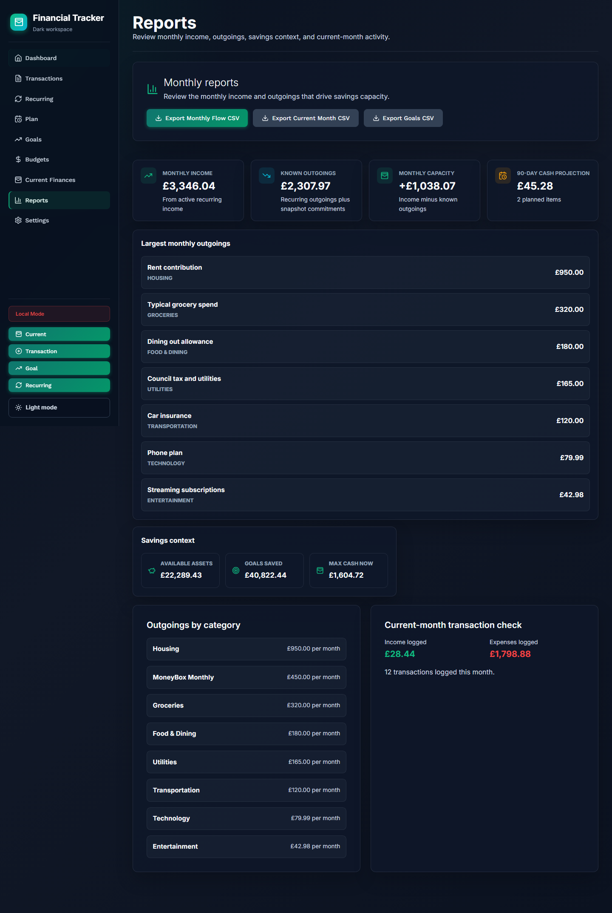
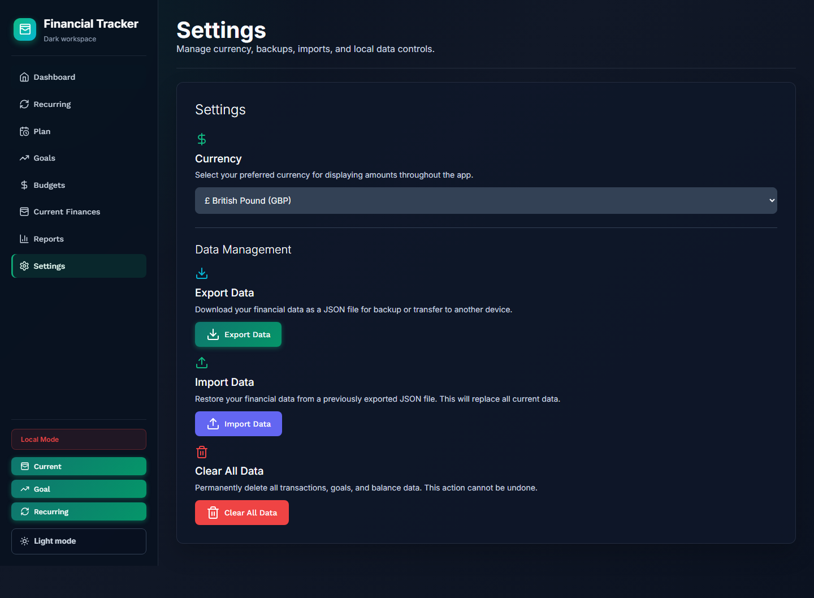

# Financial Tracker

> A monthly planning app for current finances, recurring income and outgoings, savings goals, planned commitments, and net worth trends.

[](https://johnnyvonh.github.io/financial-tracker/)
[](LICENSE)

---

## What It Does

Financial Tracker is designed around monthly planning rather than live transaction tracking. The core workflow is:

1. Capture a current-finances snapshot.
2. Add recurring income and known outgoings.
3. Review monthly budget capacity.
4. Plan upcoming costs, asset sales, and savings targets.
5. Track goals and review reports over time.

## Features

### Dashboard
- Today's money picture from the latest current-finances snapshot.
- Monthly capacity from dependable income and known recurring outgoings.
- Upcoming plan exposure and useful next-step insights.
- Quick navigation into the areas that need attention.

### Current Finances
- Flexible snapshots for bank accounts, cards, savings, investments, pensions, and monthly commitments.
- Editable snapshot template so users can add their own accounts.
- CSV import for snapshot history.
- Net worth and available-cash calculations from saved snapshots.

### Monthly Budgets
- Clear monthly budget planner built from recurring income and outgoings.
- Category breakdowns for known monthly commitments.
- Optional category limits for monthly guardrails.
- Recurring item table for scanning regular money in and out.

### Recurring Items
- Track salary, bills, subscriptions, transfers, and other regular commitments.
- Daily, weekly, biweekly, monthly, quarterly, and yearly frequencies.
- Pause, resume, edit, and delete recurring items.

### Plan
- Track upcoming costs, expected asset sales, and savings targets.
- Compare near-term plan exposure against available cash.
- Try temporary what-if scenarios without changing the saved plan.

### Goals
- Set savings targets with deadlines.
- Update current saved amounts directly from each goal card.
- See progress, remaining amounts, and goal totals.

### Reports
- Net worth trend from current-finances snapshots.
- Planning exposure and monthly planning basis.
- Rule-based insight radar.
- CSV exports for monthly flow and goals.

### Sync, Privacy, And Data
- Supabase auth and cloud sync when configured.
- Local-only fallback when Supabase is not configured.
- JSON backup import/export.
- Row Level Security for user-owned cloud data.

---

## Live Demo

[https://johnnyvonh.github.io/financial-tracker/](https://johnnyvonh.github.io/financial-tracker/)

---

## Product Screenshots

The screenshots use a dedicated demo dataset so reviews, CI checks, and documentation can show realistic finances without personal data.

### Dashboard


### Budgets


### Current Finances


### Recurring Items


### Planning And Goals




### Reports And Settings




---

## Tech Stack

- Frontend: React 18 and Vite
- Styling: Custom CSS
- Icons: Lucide React
- Authentication: Supabase Auth
- Database: Supabase PostgreSQL
- Hosting: GitHub Pages
- Charts: Recharts and custom SVG views
- Testing: Playwright

---

## Installation

### Prerequisites

- Node.js 18+ and npm
- Supabase account for cloud sync, optional for local-only use

### Local Development

1. Clone the repository:
   ```bash
   git clone https://github.com/JohnnyvonH/financial-tracker.git
   cd financial-tracker
   ```

2. Install dependencies:
   ```bash
   npm install
   ```

3. Optional: set up Supabase environment variables:
   ```bash
   cp .env.example .env.local
   ```

   Add:
   ```env
   VITE_SUPABASE_URL=https://your-project.supabase.co
   VITE_SUPABASE_ANON_KEY=your-anon-key
   ```

4. Run the development server:
   ```bash
   npm run dev
   ```

5. Open:
   ```text
   http://localhost:5173
   ```

---

## Useful Commands

```bash
npm run lint
npm run build
npm run test:e2e
npm run screenshots
```

---

## Deployment

See [DEPLOYMENT.md](DEPLOYMENT.md) for the full deployment guide.

For GitHub Pages:

1. Push to `main`.
2. GitHub Actions builds and deploys.
3. The app publishes to the configured Pages URL.

---

## Usage

### First Run

1. Sign in, or continue in local-only mode.
2. Open Current Finances and save a snapshot.
3. Add recurring income and known monthly outgoings.
4. Review Budgets to see monthly capacity.
5. Add planned costs, expected asset sales, and savings goals.
6. Use Reports to review trends and planning context.

### Main Views

- Dashboard: current cash, monthly capacity, plan exposure, and guidance.
- Current Finances: snapshot accounts, debts, savings, investments, and commitments.
- Recurring: dependable income and regular outgoings.
- Budgets: monthly flow, categories, category limits, and recurring item scan.
- Plan: dated costs, asset sales, savings targets, and what-if scenarios.
- Goals: savings targets and progress updates.
- Reports: net worth trend, planning basis, and exports.
- Settings: data import/export, currency, theme, and local data controls.

---

## Privacy And Security

- Row Level Security for Supabase-backed user data.
- Local storage fallback for users who do not configure cloud sync.
- No third-party tracking.
- Open-source codebase.
- JSON backup support.

---

## Cost

The app is intended to run on free tiers for personal use:

- GitHub Pages for hosting.
- Supabase free tier for authentication and cloud data.
- Local-only mode if cloud sync is not needed.

---

## Roadmap

- [ ] Remove remaining dead transaction-era code.
- [ ] Add recurring item forecasting by date.
- [ ] Add a planning timeline view.
- [ ] Add category limit editing directly on Budgets.
- [ ] Add a release/data health dashboard.
- [ ] Add focused unit tests for finance utilities.
- [ ] Explore bank feed integrations for future versions.

---

## Contributing

Contributions are welcome.

1. Fork the repository.
2. Create a feature branch.
3. Commit your changes.
4. Push your branch.
5. Open a pull request.

---

## License

MIT License. See [LICENSE](LICENSE).

---

Built by [Johnny von Holstein](https://github.com/JohnnyvonH).
