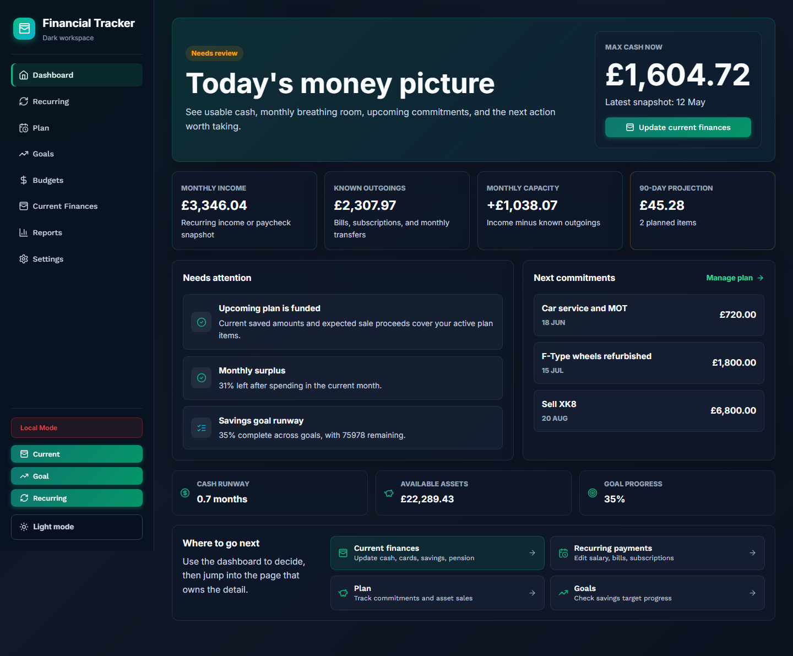

# Full Overhaul Plan

Last updated: 2026-05-12

## Goal

Make Financial Tracker feel like a smooth personal finance cockpit: fast daily entry, reliable cloud sync, clear upcoming obligations, net worth progress, and insight that helps decide what to do next.

## Current Baseline Screens

Use these demo-data screenshots as the comparison point for future redesign work:

- Dashboard: `docs/screenshots/dashboard.png`
- Current finances: `docs/screenshots/current-finances.png`
- Transactions: `docs/screenshots/transactions.png`
- Budgets: `docs/screenshots/budgets.png`
- Goals: `docs/screenshots/goals.png`
- Plan: `docs/screenshots/plan.png`
- Reports: `docs/screenshots/reports.png`
- Settings: `docs/screenshots/settings.png`

## Phase 1: Stabilise The Current App

- Apply all Supabase migrations, including finance planning.
- Move deployment from GitHub Pages to Vercel.
- Configure `VITE_SUPABASE_URL` and `VITE_SUPABASE_ANON_KEY` in Vercel project settings.
- Add Vercel preview deployments for every PR.
- Add smoke tests for app boot, transaction entry, plan item entry, and snapshot entry.

## Phase 2: Reshape The Product

- Dashboard: show cash position, upcoming costs, next paycheck estimate, savings runway, and warnings.
- Transactions: keep as the source ledger with stronger filters.
- Plan: become the planning workspace for upcoming commitments, asset sales, and goals.
- Net Worth: split snapshots into a dedicated trend view once charts are added.
- Reports: combine spending history with planning and net worth trends.

## Phase 3: Database Model

- Keep Supabase as the database and auth layer.
- Use Vercel for hosting and preview environments.
- Add tables for planning items and net worth snapshots.
- Add optional tables later for accounts, assets, liabilities, and import batches.
- Add row-level policies for every user-owned table.

## Phase 4: Insight Engine

- Forecast remaining monthly cash after known commitments.
- Show house deposit progress and required monthly saving.
- Flag when upcoming costs exceed available cash plus expected asset sales.
- Compare latest net worth snapshot with previous snapshot.
- Detect recurring spending drift from transaction history.

## Phase 5: Workbook Port

- Add CSV/XLSX import for the current spreadsheet.
- Map spreadsheet columns to `net_worth_snapshots`.
- Preview derived totals before saving.
- Preserve notes and paycheck estimates.

## Phase 6: Quality Bar

- Unit test data transforms and calculations.
- Component test critical forms.
- Browser smoke test desktop and mobile.
- Run lint and production build on every PR.
- Require passing Vercel preview and GitHub checks before merge.
